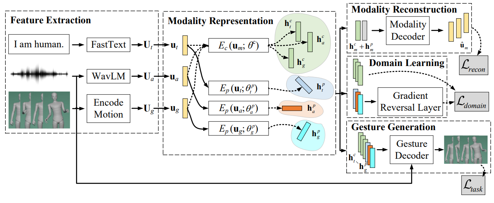

# The ReprGesture entry to the GENEA Challenge 2022

### [Conference archive](https://dl.acm.org/doi/10.1145/3536221.3558066) | [arXiv](https://arxiv.org/abs/2208.12133) | [video](https://youtu.be/KJJYEqyOq5U)

<div align=center>

</div>

## 1. Abstract

This paper describes the ReprGesture entry to the Generation and Evaluation of Non-verbal Behaviour for Embodied Agents (GENEA) challenge 2022. The GENEA challenge provides the processed datasets and performs crowdsourced evaluations to compare the performance of different gesture generation systems. In this paper, we explore an automatic gesture generation system based on multimodal representation learning. We use WavLM features for audio, FastText features for text and position and rotation matrix features for gesture. Each modality is projected to two distinct subspaces: modality-invariant and modality-specific. To learn inter modality-invariant commonalities and capture the characters of modality-specific representations, gradient reversal layer based adversarial classifier and modality reconstruction decoders are used during training. The gesture decoder generates proper gestures using all representations and features related to the rhythm in the audio.

## 2. Videos

### 2.1 Ablation study

Ground Truth (GT) / ReprGestrue / without Wavlm / without GAN loss / without domain loss / without Repr

https://user-images.githubusercontent.com/37477030/185280500-77a99aef-3c3f-4a2f-bbf1-92acf7dd395c.mp4
<!---
Please Click & Download：https://github.com/YoungSeng/ICMI2022/blob/main/Ablation_study~3.mp4
-->
### 2.2 Additional experiments

Ground Truth (GT) / ReprGestrue / with diff loss / with text emotion / with diff loss and text emotion

https://user-images.githubusercontent.com/37477030/185280702-eb5e35bb-cde9-4d4c-8f95-e25460c00334.mp4
<!---
Please Click & Download：https://github.com/YoungSeng/ICMI2022/blob/main/Additional_experiments~5.mp4
-->
However, the results of these experiments did not turn out very well, so they were not mentioned in the final submission of the system or the paper.

### 2.3 Additional ablation study

More time to talk than to listen. 

Ground Truth (GT) / ReprGestrue / without Wavlm / without GAN loss / without reconstruction loss / without domain loss / without Repr

https://user-images.githubusercontent.com/37477030/185283158-86a9a244-f447-4ee4-9aac-64cea5e79567.mp4

<!---
Please Click & Download：https://github.com/YoungSeng/ICMI2022/blob/main/Ablation_study~new2.mp4
-->

## 3. Data Processing

The distribution of speaker IDs:

<div align=center>

</div>

<!---

--->

We noted that the data in the training, validation and test sets were extremely unbalanced, so we only used the data from the speaker with identity "1" for training.

<div align=center>

</div>

<!---

--->

Due to the poor quality of hand motion-capture, we only used 18 joints corresponding to the upper body without hands or fingers.

## 4. Code

### 4.1 Dependencies

Our environment is similar to [Trimodal](https://github.com/ai4r/Gesture-Generation-from-Trimodal-Context).

Download the pre-trained model WavLM Large from [here](https://github.com/microsoft/unilm/tree/master/wavlm).

### 4.2 Quick Start

Download pre-trained model from [here](https://cloud.tsinghua.edu.cn/f/e1626f6609ef42a4a8f8/?dl=1).

Then `cd Tri/scripts` and modify save path in `synthesize.py`, run

```
python synthesize.py --ckpt_path <"..your path/multimodal_context_checkpoint_080.bin"> --transcript_path "<..your path/GENEA/genea_challenge_2022/dataset/v1_18/val/tsv/val_2022_v1_000.tsv>" --wav_path "<..your path/GENEA/genea_challenge_2022/dataset/v1_18/val/wav/val_2022_v1_000.wav>"
```

You will get the converted gestrue `.bvh`.

### 4.3 Data Preparation

Our data from [GENEA challenge 2022](https://genea-workshop.github.io/2022/challenge/) contains folders for wav, tsv and bvh, the original data is from [Talking With Hands 16.2M](https://doi.org/10.1109/ICCV.2019.00085). You can refer to the challenge paper and download from [here](https://youngwoo-yoon.github.io/GENEAchallenge2022/).
> Youngwoo Yoon, Pieter Wolfert, Taras Kucherenko, Carla Viegas, Teodor Nikolov, Mihail Tsakov, and Gustav Eje Henter. 2022. The GENEA
Challenge 2022: A large evaluation of data-driven co-speech gesture generation. In Proceedings of the ACM International Conference on Multimodal
Interaction (ICMI ’22). ACM.

Then `cd My/scripts` and modify path in `twh_dataset_to_lmdb.py`, run
```
python twh_dataset_to_lmdb.py <..your path/GENEA/genea_challenge_2022/dataset/v1_18_1/>
```

### 4.4 Training and Inference

Then `cd Tri/scripts` and modify path in `train.py` and modify `<path = "...your path/wavlm_cache/WavLM-Large.pt">` in `multimodal_context_net.py`, run
```
python train.py --config=<..your path/Tri/config/multimodal_context.yml>
```

For inference, run

```
python synthesize.py --ckpt_path <"..your path/your saved model.bin"> --transcript_path "...your path/dataset/v1_18/val/tsv/val_2022_v1_000.tsv" --wav_path "...your path/dataset/v1_18/val/wav/val_2022_v1_000.wav"
```

### 4.5 Evaluation

Our code is adapted from [here](https://github.com/genea-workshop/genea_numerical_evaluations).
You may refer to `./visualizations/genea_numerical_evaluations_1`.

An AutoEncoder model we trained on data from GENEA can be downloaded from [here](https://cloud.tsinghua.edu.cn/f/5aabcd8c79f84dc19d31/?dl=1) and used to calculate the FGD.

## 5.Visualization

For visualization of output, you can use ./visualizations/simple_skeleton_visualization/:

https://user-images.githubusercontent.com/37477030/185100890-667a62e0-cabb-4c73-803c-56a4790dbea9.mp4

Or using ./visualizations/genea_visualizer/celery-queue/blender_render.py based on [here](https://github.com/TeoNikolov/genea_visualizer):

https://user-images.githubusercontent.com/37477030/185101112-83a2bd6d-a204-4e49-9291-601ddab5a342.mp4

```
"... your path\Blender Foundation\Blender 2.93\blender.exe" -b --python blender_render.py -- -i "... your path\multimodal_context_40_generated.bvh" -a "... your path\audio.wav" -v -o "... your path\video" -m "upper_body" --duration 40 -r cw
```

## 6. Acknowledgement and References

This work is supported by Shenzhen Science and Technology Innovation Committee (WDZC20200818121348001), National Natural Science Foundation of China (62076144) and Shenzhen Key Laboratory of next generation interactive media innovative technology (ZDSYS20210623092001004).

Our work mainly inspired by:

(1) [Gesture Generation from Trimodal Context](https://github.com/ai4r/Gesture-Generation-from-Trimodal-Context)

> Youngwoo Yoon, Bok Cha, Joo-Haeng Lee, Minsu Jang, Jaeyeon Lee, Jaehong Kim, and Geehyuk Lee. 2020. Speech gesture generation from the trimodal context of text, audio, and speaker identity. ACM Trans. Graph. 39, 6, Article 222 (December 2020), 16 pages. https://doi.org/10.1145/3414685.3417838


(2) [MISA: Modality-Invariant and -Specific Representations for Multimodal Sentiment Analysis](https://github.com/declare-lab/multimodal-deep-learning/tree/main/MISA)


> Devamanyu Hazarika, Roger Zimmermann, and Soujanya Poria. 2020. MISA: Modality-Invariant and -Specific Representations for Multimodal Sentiment Analysis. In Proceedings of the 28th ACM International Conference on Multimedia (MM '20). Association for Computing Machinery, New York, NY, USA, 1122–1131. https://doi.org/10.1145/3394171.3413678

## 7. Citation

If you find our work useful in your research, please consider citing:

```
@inproceedings{yang2022genea,
  author={Sicheng Yang, Zhiyong Wu, Minglei Li, Mengchen Zhao, Jiuxin Lin, Liyang Chen, Weihong Bao},
  title={The ReprGesture entry to the GENEA Challenge 2022},
  booktitle = {Proceedings of the ACM International Conference on Multimodal Interaction},
  publisher = {ACM},
  series = {ICMI '22},
  year={2022}
}
```
